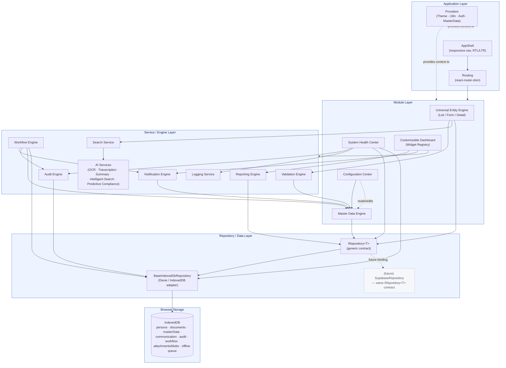

# GRRK — Architecture Overview (Stage 0)

This document is the visual companion to the approved Implementation
Blueprint (`10_IMPLEMENTATION_BLUEPRINT`, Section 17). It shows how the
Stage 0 foundation layers relate to each other and to the engines/modules
that later stages will build on top of them.

## Layer Diagram

## Reading the diagram

- **Application Layer** — the shell every page renders inside: responsive
  navigation, routing, and the provider tree (Theme/RTL, i18n, Auth stub,
  Master Data cache).
- **Module Layer** — Stage 0's four foundation modules. The Universal
  Entity Engine is generic (17.3): later stages configure it per entity
  rather than writing new pages. The Dashboard and System Health Center
  share one Widget framework (17.7 / 17.11).
- **Service / Engine Layer** — business-agnostic *frameworks*. They define
  contracts and orchestration (queues, registries, evaluators) but Stage 0
  intentionally does not populate them with real business rules — see the
  Implementation Blueprint's Stage 1–7 sequencing.
- **Repository / Data Layer** — the single seam (`IRepository<T>`) that
  makes storage swappable (Standard 17.1). `BaseIndexedDbRepository` is the
  only Stage 0 implementation; a future `SupabaseRepository` fulfilling the
  same contract is the entirety of the Cloud Migration work (Blueprint
  Section 13), shown as the dashed future node above.
- **Browser Storage** — one Dexie/IndexedDB database, storing structured
  records and binary blobs (attachments, voice recordings) side by side, per
  Standard 17.6.

## Cross-cutting dependencies (not layer-bound)

- **Audit Engine** is called automatically by `BaseIndexedDbRepository` on
  every write — no module calls it directly for CRUD.
- **Master Data** underpins Validation, Notification, Workflow, and
  Configuration Center simultaneously — it is the single source of
  configurable thresholds/lists (Standard 17.5), not duplicated per engine.
- **AI Services** are consumed through the same binding pattern as
  repositories: a mock today, a real implementation later, with no change to
  callers (Standard 17.8).

## What Stage 0 deliberately leaves as contracts only

The Notification, Reporting, and Workflow engines exist as fully wired
*frameworks* (queues, registries, definitions, persistence) but carry no
real business rules yet — no expiry thresholds, no standard reports, no
approval chains. Populating them is Stage 1 onward, per the Implementation
Blueprint's development sequence (Section 14).
